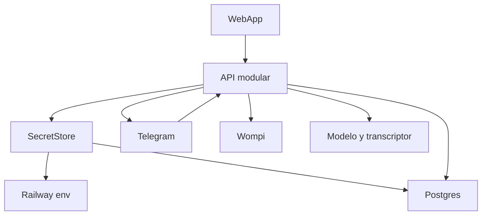

# Component Dependencies — hy10

## Dependency Matrix

La flecha significa "depende de".

| Componente | Depende de |
|------------|------------|
| WebApp | Access, Catalog, Agenda, Reservations, Billing, Settings, Clients, Audit |
| Access | Audit |
| Catalog | Audit |
| Agenda | Catalog, Reservations |
| Reservations | Catalog, Agenda, Clients, Audit |
| Clients | Access |
| TelegramGateway | SecretStore, SpeechTranscriber, Agent, Notifications |
| SpeechTranscriber | SecretStore |
| Agent | Catalog, Agenda, Reservations, Clients, Billing, Settings, Audit |
| Billing | Reservations, SecretStore, Audit, Notifications |
| Settings | SecretStore, Audit |
| SecretStore | Postgres y el entorno de Railway. No depende de un componente de negocio |
| Notifications | TelegramGateway, Clients |
| Audit | Postgres |

Notifications y TelegramGateway se llaman entre sí para el texto saliente. El gateway no vuelve a interpretar ese texto como un turno del agente.

## Communication Patterns

- La web usa HTTPS y JWT hacia `/api/v1`.
- Telegram usa el webhook. La API responde texto por la Bot API.
- Wompi usa un webhook firmado.
- El modelo y el transcriptor son llamadas salientes con timeout.
- No hay eventos entre servicios de nube propios. El aviso del Staff lo dispara un proceso dentro de la API.

## Data Flow

### Text Alternative

La web y Telegram entran a la API. SecretStore lee las claves de despliegue en Railway y el token cifrado en Postgres. La API persiste el negocio en Postgres, cobra con Wompi y llama al modelo y al transcriptor. La respuesta al Cliente sale por Telegram.

## Secret Rules

- El ciphertext del bot usa AES-256-GCM. La clave maestra no está en la base.
- La web recibe una máscara, no el token.
- Logs, auditoría y respuestas de error no incluyen claves, token, audio ni datos de tarjeta.
- `handleWebhook` rechaza si `TELEGRAM_WEBHOOK_SECRET` falta o no coincide.
