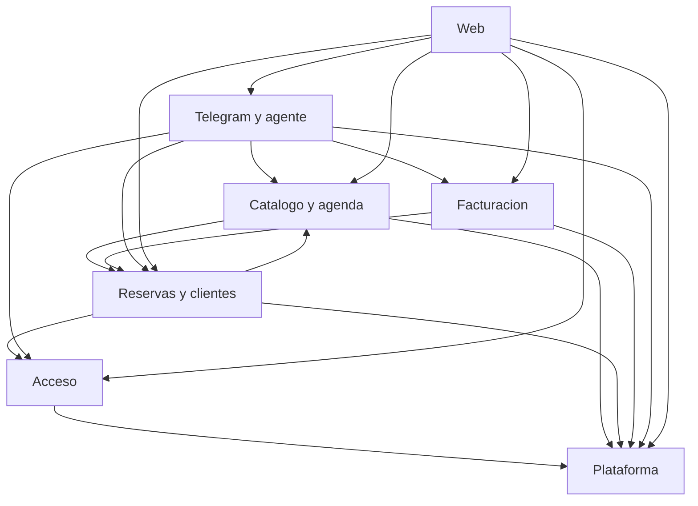

# Unit of Work Dependencies — hy10

La flecha significa "depende de". Las llamadas de la API son en proceso. La web usa HTTPS.

## Dependency Matrix

| Unidad | Depende de |
|--------|------------|
| Plataforma | Postgres `platform`. Expone un puerto de envío de texto que implementa Telegram y agente |
| Acceso | Plataforma |
| Catálogo y agenda | Plataforma, Reservas y clientes |
| Reservas y clientes | Catálogo y agenda, Plataforma, Acceso |
| Facturación | Reservas y clientes, Plataforma |
| Telegram y agente | Plataforma, Acceso, Catálogo y agenda, Reservas y clientes, Facturación |
| Web | Acceso, Catálogo y agenda, Reservas y clientes, Facturación, Plataforma, Telegram y agente |

Catálogo y agenda lee reservas para calcular huecos. Reservas y clientes lee catálogo y agenda para crear o mover un turno. Ese ciclo es de lectura en el mismo proceso. No parte la API en dos despliegues.

El puerto de envío evita que un aviso vuelva a entrar al agente. Plataforma pide el envío. Telegram y agente lo entrega y no lo interpreta como un turno nuevo.

## Secuencia de una sola persona

1. Plataforma, con el puerto de envío todavía sin implementación de Telegram.
2. Acceso.
3. Catálogo y agenda, con las tablas de horario y servicio.
4. Reservas y clientes, y el cálculo de huecos que ya puede leer reservas.
5. Facturación.
6. Telegram y agente, que cubre el puerto de envío.
7. Web.

## Communication

### Text Alternative

Acceso, catálogo, reservas, facturación y Telegram dependen de Plataforma. Catálogo y reservas se leen entre sí. Reservas también depende de Acceso. Facturación depende de reservas. Telegram depende de acceso, catálogo, reservas y facturación. La web depende de las seis unidades de la API por HTTPS.
