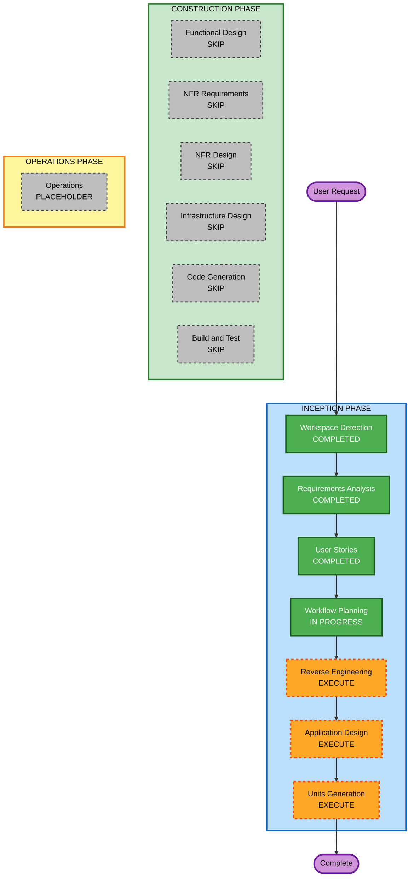

# Execution Plan — hy10

## Detailed Analysis Summary

### Baseline

hy10 no parte de cero. El workspace de hy10 no tiene aún el código copiado, y la base que se analiza es el repositorio [HiTurno](https://github.com/garestrepop/hiturno) (`main`).

Se toma la arquitectura, el modelo de datos, `.specify` (constitución, features, ADR, product), `contexto`, `apps`, `docs` y el resto que sirva para el diseño.

No se lleva la multitenancy al producto hy10: sin `tenant_id` como eje, sin cambio de negocio, sin token de tenant y sin subdominio por negocio. Reverse Engineering igual los lee, para saber qué se recorta.

Material ya visto en el repo:

| Área | Contenido |
|------|-----------|
| `apps/api` | NestJS. Módulos: accounts, auth, roles, tenants, memberships, services, staff, schedules, clients, appointments, invitations, notifications, ai-agent, telegram, whatsapp, billing, audit, platform-config, crm, health, support |
| `apps/web` | Next.js |
| `apps/api/src/database` | TypeORM, migraciones |
| `.specify` | Constitución, product, features F01–F20, ADR-01 a ADR-22 |
| `contexto` | Contexto, arquitectura, requisitos de front y back, módulos |
| `docs` | Entornos, estado del proyecto, cierres de MVP |
| `packages` | Tipos y utilidades compartidas |

### Change Impact Assessment

- **User-facing changes**: Sí. Web para Admin y Staff. Telegram para Cliente, Staff y Admin. UI de hy10 sigue siendo nueva.
- **Structural changes**: Sí, a partir de la arquitectura de HiTurno, recortando el eje tenant.
- **Data model changes**: Sí. Se parte del modelo de HiTurno y se adapta a un solo negocio, más la factura interna de hy10.
- **API changes**: Sí. El contrato de hy10 sale de los módulos útiles, sin rutas de tenant.
- **NFR impact**: Sí. Auth propia (ADR-02, sin Supabase Auth), cero doble reservas, Wompi, backup and restore, una región.

### Risk Assessment

- **Risk Level**: High
- **Rollback Complexity**: Moderate en un despliegue futuro. En este ciclo no hay despliegue.
- **Testing Complexity**: Complex. Hay que distinguir lo que se hereda de HiTurno de lo que la multitenancy obliga a quitar.

Profundidad alta en Reverse Engineering, Application Design y Units Generation.

## Workflow Visualization

### Text Alternative

INCEPTION, en orden:
- Workspace Detection: COMPLETED
- Requirements Analysis: COMPLETED
- User Stories: COMPLETED
- Workflow Planning: IN PROGRESS
- Reverse Engineering de HiTurno: EXECUTE
- Application Design: EXECUTE
- Units Generation: EXECUTE

CONSTRUCTION, este ciclo: Functional Design, NFR Requirements, NFR Design, Infrastructure Design, Code Generation y Build and Test en SKIP.

OPERATIONS: PLACEHOLDER.

## Phases to Execute

### INCEPTION PHASE

- [x] Workspace Detection (COMPLETED)
- [x] Requirements Analysis (COMPLETED)
- [x] User Stories (COMPLETED)
- [x] Execution Plan (IN PROGRESS, revisado: la base es HiTurno)
- [ ] Reverse Engineering — EXECUTE
  - **Rationale**: hy10 hereda el código y la especificación de HiTurno. Hay que documentar arquitectura, modelo, specify, ADR, features, product, contexto, apps y docs antes de diseñar. La multitenancy se documenta para excluirla, no para copiarla. Profundidad alta.
- [ ] Application Design — EXECUTE
  - **Rationale**: Los componentes de hy10 se definen sobre ese mapa, con las reglas ya aprobadas (un negocio, Telegram, factura interna, UI nueva). Profundidad alta.
- [ ] Units Generation — EXECUTE
  - **Rationale**: Las unidades salen de los módulos útiles de HiTurno más lo que hy10 agrega. Profundidad alta.

### CONSTRUCTION PHASE

- [ ] Functional Design — SKIP en este ciclo
  - **Rationale**: Este ciclo termina en la especificación de Inception.
- [ ] NFR Requirements — SKIP en este ciclo
  - **Rationale**: Los NFR ya están en `requirements.md`.
- [ ] NFR Design — SKIP en este ciclo
  - **Rationale**: No se diseña el despliegue en este ciclo. Application Design igual respeta esas restricciones.
- [ ] Infrastructure Design — SKIP en este ciclo
  - **Rationale**: No hay recursos que provisionar ahora.
- [ ] Code Generation — SKIP en este ciclo
  - **Rationale**: Question 1 = A. No se genera código de hy10 en este ciclo. El código de HiTurno se lee; no se copia todavía a este workspace.
- [ ] Build and Test — SKIP en este ciclo
  - **Rationale**: No hay build de hy10 en este ciclo.

### OPERATIONS PHASE

- [ ] Operations — PLACEHOLDER
  - **Rationale**: El marco aún no ejecuta despliegue ni monitoreo.

## Estimated Timeline

- **Etapas que faltan**: 3 (Reverse Engineering, Application Design, Units Generation)
- **Duración**: no se estima en días. Cada etapa cierra con tu revisión.

## Success Criteria

- **Primary Goal**: Especificación de Inception de hy10 apoyada en HiTurno, sin multitenancy.
- **Key Deliverables**: artefactos de reverse engineering del repo, diseño de aplicación y unidades de trabajo, trazados a US-01–US-26 y FR-01–FR-51.
- **Quality Gates**: tu aprobación al final de cada etapa.

## Security, resiliency, and PBT in this plan

Reverse Engineering describe los controles que ya existen en HiTurno. Application Design hereda las restricciones de `requirements.md`: autorización en servidor, cifrado y TLS, webhook de Wompi firmado e idempotente, sin datos de tarjeta, backup and restore y una región. Esas reglas no se relajan por reutilizar el repo.
