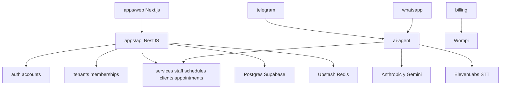
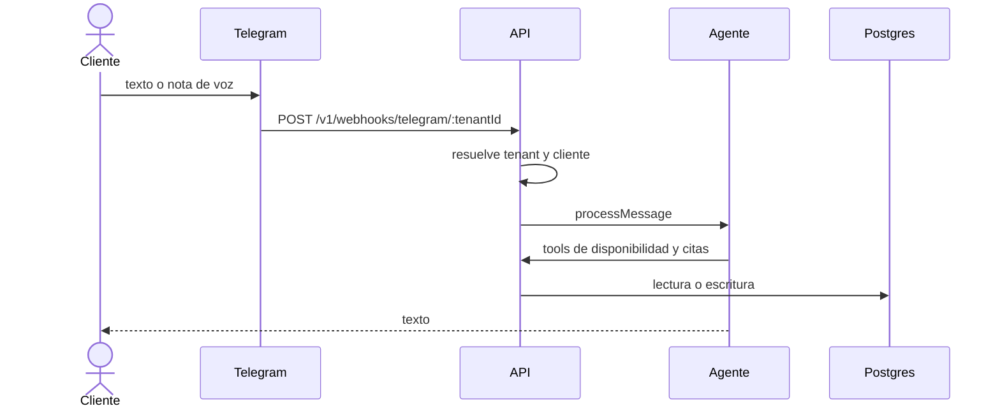

# System Architecture — HiTurno

**Fuente**: https://github.com/garestrepop/hiturno (`main`)  
**Leído**: árbol de 664 rutas de código y configuración, controladores, entidades y `package.json`. No se copió el repo al workspace de hy10.

## System Overview

Monolito modular NestJS (`apps/api`) y web Next.js (`apps/web`), en un monorepo pnpm + Turborepo. Postgres en Supabase, solo como base. Auth propia con Passport y JWT. Redis en Upstash para sesión y límites. El agente habla con un `LLMProvider`. Telegram y WhatsApp son adaptadores. Wompi cobra la suscripción del negocio.

hy10 reutiliza la forma: API modular, web aparte, tools del agente, webhook y Postgres. Quita el eje tenant.

## Architecture Diagram

### Text Alternative

La web llama a la API. La API separa auth, tenants y el dominio de citas. Telegram y WhatsApp entran al agente. El agente llama al dominio, al LLM y al transcriptor. Billing llama a Wompi. La API persiste en Postgres y usa Redis.

## Component Descriptions

### apps/api

- **Purpose**: Backend.
- **Responsibilities**: Módulos Nest, TypeORM, webhooks, Swagger.
- **Dependencies**: Postgres, Redis, LLM, STT, SendGrid, Wompi, Telegram, Meta.
- **Type**: Application
- **hy10**: Se toma el corte en módulos. Se eliminan tenants, memberships, CRM de plataforma y el billing de planes. Billing de hy10 es otra factura.

### apps/web

- **Purpose**: App Router para el equipo y el CRM.
- **Responsibilities**: UI, React Query, Zustand.
- **Dependencies**: API, paquetes shared.
- **Type**: Application
- **hy10**: No se copia la UI. Sirve como referencia de pantallas operativas.

### apps/landing

- **Purpose**: Landing estática del SaaS.
- **Type**: Application
- **hy10**: Fuera.

### packages/shared-types, shared-utils, shared-design-tokens

- **Purpose**: Tipos, utilidades y tokens visuales.
- **Type**: Shared
- **hy10**: Tipos de dominio sí, si se les quita el tenant. Tokens visuales no obligan la UI nueva.

## Data Flow

### Text Alternative

El cliente escribe o manda voz a Telegram. El webhook lleva un `tenantId`. La API resuelve tenant y cliente, el agente ejecuta tools y responde en texto.

En hy10 el webhook no lleva `tenantId`. Hay un solo bot. La nota de voz se transcribe y sigue el mismo flujo. La respuesta sigue en texto.

## Integration Points

- **External APIs**: Telegram Bot API, Meta WhatsApp Cloud API, Anthropic, Google Gemini, ElevenLabs, Wompi, SendGrid, Google OAuth.
- **Databases**: Postgres (Supabase) con esquemas de auth y de negocio. Redis Upstash.
- **Third-party Services**: los de arriba. No hay Supabase Auth (ADR-02).

## Infrastructure Components

- **CDK Stacks**: no hay CDK ni Terraform en el árbol revisado.
- **Deployment Model**: API en Railway, web en Vercel, Postgres en Supabase. CI en GitHub Actions (carpeta `.github` presente en el repo).
- **Networking**: la API publica HTTP. Helmet y ValidationPipe están en `main.ts`. El prefijo de API es configurable y la versión de ruta es `v1`.

## Recorte de multitenancy

Estas piezas existen y no pasan a hy10 como producto:

- Entidad `tenants` y `account_tenant_memberships`
- `POST /v1/auth/switch-tenant/:tenantId` y la sesión de tenant
- `tenant_id` en las tablas de negocio
- Webhook `POST /v1/webhooks/telegram/:tenantId`
- RLS pensado con `app.current_tenant_id`
- Subdominio por negocio

El `Account` de HiTurno no lleva `tenant_id` (ADR-01). En hy10 la cuenta del equipo es de un solo negocio: se puede reutilizar la idea de Account sin la membership.
