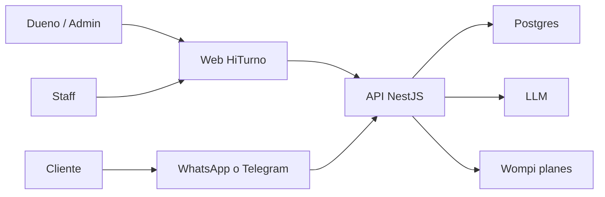

# Business Overview — HiTurno

**Fuente**: https://github.com/garestrepop/hiturno (`main`)  
**Uso en hy10**: mapa de negocio de origen. hy10 no es este SaaS. Es un CRM de un solo negocio.

## Business Context

HiTurno es un SaaS multitenant de agendamiento por chat para negocios de servicios en LATAM. El dueño y el staff operan una web. El cliente reserva por WhatsApp o por Telegram, un canal activo a la vez. La plataforma cobra al negocio con planes y tokens (Wompi), no al cliente por el servicio prestado.

### Text Alternative

El dueño y el staff usan la web. El cliente usa WhatsApp o Telegram. Ambos canales llegan a la API. La API usa Postgres, un LLM y Wompi para la suscripción del negocio.

## Business Description

- **Business Description**: Varios negocios aislados por tenant. Cada uno tiene servicios, staff, horarios, clientes y citas. Un agente ejecuta esas citas por tools. La plataforma administra tenants, planes y soporte.
- **Business Transactions**: registro y login, alta de negocio, invitación de miembros, catálogo y agenda, reserva conversacional, notificación, suscripción y cobro de la plataforma, auditoría, ticket de soporte.
- **Business Dictionary**: Account es la persona. Tenant es el negocio. Membership une ambos con un rol. Cliente final no necesita Account para agendar. `isBookingReady` en HiTurno exige teléfono verificado. Canal conversacional es uno por tenant.

## Qué conserva hy10

El núcleo de citas: servicio, staff, horario, cliente, reserva, solape, invitación de staff, agente con tools, Telegram, auditoría y un adaptador de pago. La identidad del cliente en hy10 es `telegram_user_id`. El pago de hy10 es el del servicio ya prestado, no la suscripción del SaaS.

## Qué no es transacción de hy10

Crear tenant, cambiar de negocio, suscribir un plan, consumir tokens de plataforma, CRM de superadmin, marketing, WhatsApp como canal y onboarding por OTP de teléfono.

## Component Level Business Descriptions

### apps/api

- **Purpose**: Autoridad de identidad, agenda, canal y cobro de plataforma.
- **Responsibilities**: Auth, tenants, citas, agente, webhooks, facturas de suscripción.

### apps/web

- **Purpose**: Superficie de dueño, staff y CRM de plataforma.
- **Responsibilities**: Login, workspace del negocio, configuración, billing de planes.

### .specify

- **Purpose**: Specs, ADR y constitución del SaaS.
- **Responsibilities**: Contrato de producto de HiTurno, no el de hy10.
