# Code Structure — HiTurno

## Build System

- **Type**: pnpm workspaces + Turborepo
- **Configuration**: `package.json` (`packageManager` pnpm 9.15.0), `pnpm-workspace.yaml`, `pnpm-lock.yaml`, `turbo.json`, `tsconfig.base.json`
- **Engines**: Node `>=20`, pnpm `>=9`
- **Scripts**: `dev`, `dev:api`, `dev:web`, `build`, `lint`, `test`, `typecheck`

## Key Classes and Modules

```mermaid
flowchart TD
    AppModule["AppModule"]
    AppModule --> Auth["auth"]
    AppModule --> Accounts["accounts"]
    AppModule --> Tenants["tenants"]
    AppModule --> Memberships["memberships"]
    AppModule --> Services["services"]
    AppModule --> Staff["staff"]
    AppModule --> Schedules["schedules"]
    AppModule --> Clients["clients"]
    AppModule --> Appointments["appointments"]
    AppModule --> Invitations["invitations"]
    AppModule --> Notifications["notifications"]
    AppModule --> Agent["ai-agent"]
    AppModule --> Telegram["telegram"]
    AppModule --> Whatsapp["whatsapp"]
    AppModule --> Billing["billing"]
    AppModule --> Audit["audit"]
    AppModule --> Platform["platform-config"]
    AppModule --> Crm["crm"]
    AppModule --> Health["health"]
    AppModule --> Support["support"]
    AppModule --> Roles["roles"]
```

### Text Alternative

`AppModule` importa auth, accounts, tenants, memberships, services, staff, schedules, clients, appointments, invitations, notifications, ai-agent, telegram, whatsapp, billing, audit, platform-config, crm, health, support y roles.

### Existing Files Inventory

Se listó el árbol remoto: 664 rutas con extensión de código o configuración. El inventario útil para hy10 es por módulo, no archivo por archivo. Conteos bajo `apps/api/src/modules/`:

| Módulo | Archivos | hy10 |
|--------|----------|------|
| ai-agent | 67 | Heredar tools, interfaz de LLM y STT. Quitar tier fast/smart y tenant de la traza |
| tenants | 26 | No heredar |
| whatsapp | 22 | No heredar como canal |
| notifications | 22 | Heredar el patrón de eventos. Canal del cliente: Telegram |
| crm | 22 | No heredar |
| billing | 19 | Heredar el webhook de Wompi como patrón. No heredar suscripción ni tokens |
| auth | 17 | Heredar login, Google, refresh y reset. No heredar switch-tenant |
| appointments | 15 | Heredar |
| telegram | 14 | Heredar, con un solo bot |
| support | 9 | No heredar |
| services | 9 | Heredar |
| clients | 9 | Heredar, identidad Telegram |
| audit | 9 | Heredar append-only, sin eventos de tenant |
| schedules | 8 | Heredar |
| platform-config | 7 | Adaptar a configuración del único negocio |
| staff | 6 | Heredar |
| memberships | 6 | No heredar |
| invitations | 6 | Heredar invitación de staff |
| accounts | 6 | Heredar la cuenta, sin multi-negocio |
| health | 5 | Heredar |
| roles | 3 | Heredar el chequeo de rol, sin rol de plataforma |

Entidades en `apps/api/src/modules/**/entities/` y `common/entities/base.entity.ts`. Controladores listados en `api-documentation.md`.

## Design Patterns

### Módulo Nest por capacidad

- **Location**: `apps/api/src/modules/*`
- **Purpose**: Separar auth, dominio, canal y billing.
- **Implementation**: Un módulo, controladores versionados `v1`, servicios y entidades TypeORM.

### Adaptador de proveedor

- **Location**: `ai-agent/providers/llm-provider.interface.ts`, `speech-to-text-provider.interface.ts`, `config/wompi.config.ts`
- **Purpose**: El resto del código no importa el SDK.
- **Implementation**: Interfaces más clientes de Anthropic, Gemini y ElevenLabs.

### Soft delete y base común

- **Location**: `common/entities/base.entity.ts`
- **Purpose**: Id y marcas de tiempo compartidas.
- **Implementation**: Las entidades de negocio extienden esa base y casi todas llevan `tenant_id`.

## Critical Dependencies

### @nestjs/core y @nestjs/common

- **Version**: ^11.0.1
- **Usage**: API
- **Purpose**: Módulos HTTP

### typeorm y @nestjs/typeorm

- **Version**: typeorm ^0.3.20
- **Usage**: Entidades y migraciones en `apps/api/src/database`
- **Purpose**: Postgres

### @nestjs/passport, passport-jwt, passport-local, passport-google-oauth20

- **Version**: passport ^0.7.0, jwt plugin ^11.0.5
- **Usage**: `modules/auth`
- **Purpose**: Auth propia, sin Supabase Auth

### @upstash/redis

- **Version**: ^1.34.4
- **Usage**: Sesión de conversación y límites
- **Purpose**: Estado efímero

### next y react

- **Version**: next ^16.0.0, react ^19.0.0
- **Usage**: `apps/web`
- **Purpose**: UI del SaaS. hy10 no copia esas pantallas.
