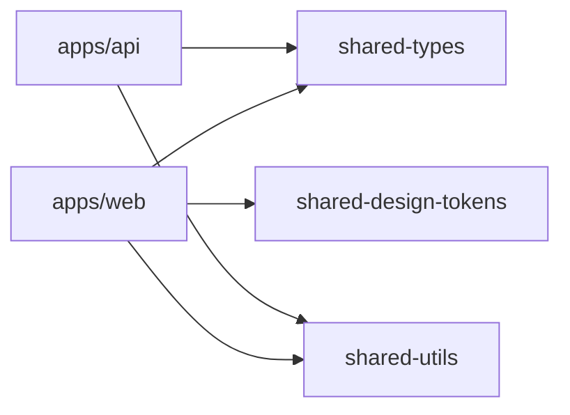

# Dependencies — HiTurno

## Internal Dependencies

### Text Alternative

`apps/web` depende de shared-types, shared-utils y shared-design-tokens. `apps/api` depende de shared-types y shared-utils. La landing no entra en esos workspaces de la misma forma.

### apps/web depende de packages

- **Type**: Compile
- **Reason**: Tipos, utilidades y tokens de UI

### apps/api depende de packages

- **Type**: Compile
- **Reason**: Tipos y utilidades compartidas con la web

### apps/api no depende de apps/web

- **Type**: ninguna
- **Reason**: La web consume la API por HTTP

## External Dependencies

Licencias no verificadas en este pase. No se inventa la licencia.

### @nestjs/common, @nestjs/core, @nestjs/platform-express

- **Version**: ^11.0.1
- **Purpose**: HTTP del monolito
- **License**: no verificada en este pase

### typeorm, pg

- **Version**: ^0.3.20 y pg ^8.13.1
- **Purpose**: Postgres
- **License**: no verificada en este pase

### @nestjs/passport, passport, passport-jwt, passport-local, passport-google-oauth20, @nestjs/jwt

- **Version**: ver `apps/api/package.json`
- **Purpose**: Auth propia
- **License**: no verificada en este pase

### @upstash/redis

- **Version**: ^1.34.4
- **Purpose**: Sesión del agente y rate limit
- **License**: no verificada en este pase

### @anthropic-ai/sdk y @google/generative-ai

- **Version**: ^0.105.0 y ^0.24.1
- **Purpose**: Proveedores concretos detrás de `LLMProvider`
- **License**: no verificada en este pase
- **hy10**: El SDK queda dentro del adaptador. El producto no fija estos dos proveedores.

### @sendgrid/mail

- **Version**: ^8.1.4
- **Purpose**: Correo de verificación, reset e invitación
- **License**: no verificada en este pase

### helmet, @nestjs/throttler, class-validator

- **Version**: helmet ^8.0.0, throttler ^6.4.0
- **Purpose**: Cabeceras y límite de requests
- **License**: no verificada en este pase

### next, react, @tanstack/react-query, zustand, tailwindcss, zod

- **Version**: next ^16, react ^19, react-query ^5.62.7, zustand ^5.0.2, tailwind ^3.4.17
- **Purpose**: Web
- **License**: no verificada en este pase

## Dependencia de producto que hy10 no arrastra

WhatsApp Cloud API, modelo de suscripción Wompi y cualquier tabla con `tenant_id` como clave de aislamiento.
